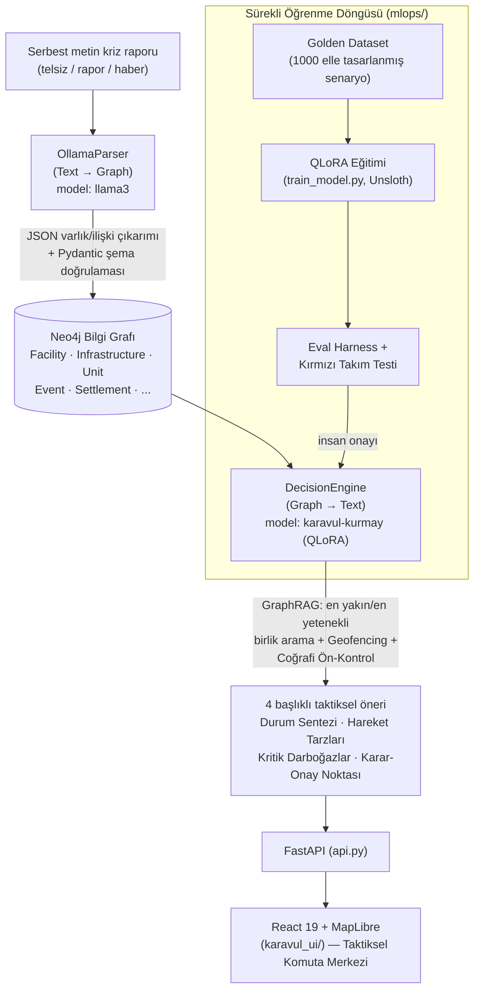

# 🛰️ KARAVUL — Kriz ve Afet Yönetimi Karar Destek Sistemi

**Karavul, karar vermez, kararı hızlandırır; elindeki veriyi asla aşmaz ve bilmediği şeyi asla uydurmaz.

Karavul; Türkiye çapında (81 il, sokak seviyesi coğrafi çözünürlükte) çalışan, serbest metin kriz raporlarını bir **Neo4j Bilgi Grafı**na işleyen, bu graf üzerinde **GraphRAG** yöntemiyle en yakın/en yetenekli müdahale birliğini arayan ve yerel olarak barındırılan, **QLoRA ile ince ayarlanmış** bir büyük dil modeli (`karavul-kurmay`) ile 4 başlıklı taktiksel öneri (Durum Sentezi / Hareket Tarzları / Kritik Darboğazlar / Karar-Onay Noktası) üreten bir karar destek sistemidir. Kapalı-devre (air-gapped) TSK/AFAD/UMKE dağıtımı hedefiyle, tamamen yerel/çevrimdışı çalışacak şekilde tasarlanmıştır.


---

## Felsefe: "Danışman, Aktör Değil"

Kriz anında en büyük risk, bir dil modelinin var olmayan bir birimi, sayıyı ya da rotayı **uydurmasıdır**. Karavul bu riski, üç bağımsız katmanda ele alır:

1. **Şema seviyesinde**: Bilgi Grafı'nda karşılığı olmayan bir varlık (uydurma birim, sahte koordinat, geçersiz bir "ateş açma emri" ilişkisi) Pydantic doğrulaması tarafından **otomatik reddedilir** — grafın dışına asla çıkılamaz.
2. **Coğrafi mantık seviyesinde**: "Ankara'da Tsunami" gibi fiziksel olarak imkânsız bir öncül, LLM'e hiç gönderilmeden **Coğrafi Ön-Kontrol** tarafından anında reddedilir; "Rize krizine İstanbul'dan birlik" gibi bir öneri, **İl/İlçe Geofencing** kilidiyle veri katmanında yapısal olarak imkânsız kılınır.
3. **Üretim (metin) seviyesinde**: Model, Bilgi Grafı'nın kendisine "BULUNAMADI" dediği bir birliği yine de icat etmeye kalkışırsa, bu **isim çapraz doğrulama** ile yakalanır; ısrar ederse dürüst bir yer tutucu metinle değiştirilir. Model asla "gönderdim", "vurdum" gibi birinci şahıs tamamlanmış-eylem beyanı vermez ve rolü dışındaki komutları (ör. "ateş açma emri verin") yok sayar.

---

## Mimari



### Uçtan uca akış

| Aşama | Bileşen | Model / Teknoloji |
|---|---|---|
| Metinden grafa | `src/data_ingestion/nlp_parser.py` | Ollama — `llama3` (genel amaçlı çıkarım) |
| Bilgi Grafı | `src/core/database.py`, `src/core/models.py` | Neo4j (POINT index'li mekansal sorgular) |
| Coğrafi kilitler | `src/core/turkiye_harita.py` | 81 il komşuluk haritası + kıyı/dağlık/volkanik profil |
| Karar motoru | `src/core/decision_engine.py` | GraphRAG + Ollama — `karavul-kurmay` (QLoRA fine-tune) |
| API | `api.py` | FastAPI |
| Arayüz | `karavul_ui/` | React 19 + Vite + MapLibre (taktiksel 3B harita) |
| Sürekli öğrenme | `mlops/` | Unsloth/QLoRA eğitim + Golden Dataset + eval/kırmızı-takım |

---

## Öne Çıkan Özellikler

- **27 kriz tipi taksonomisi** (Deprem/Sel/Yangın'dan Tsunami, Gemi Kazası, Salgın Hastalık, Kimyasal Sızıntı, Volkanik Patlama'ya kadar) — her biri kendi gerçek müdahale profiline (birim önceliği) sahiptir.
- **İl/İlçe Siyasi Harita Kilidi (Geofencing)**: "en yakın birlik" araması, olayın ili + kara sınırı komşularıyla sınırlıdır; km-yarıçapı ne olursa olsun bu sınır aşılamaz.
- **Coğrafi Ön-Kontrol (Sanity Check)**: Olay türü ile bulunduğu bölgenin fiziksel yapısı (kıyı/dağlık/volkanik) çelişiyorsa, öneri LLM'e gitmeden reddedilir.
- **Mekansal Körlük Düzeltmesi**: "En yakın birlik" sadece kuş uçuşu mesafeyle değil, **gerçek açık yol ağı üzerinden Dijkstra** mesafesiyle bulunur — kapalı bir yolla izole olmuş birim asla önerilmez.
- **Yetenek Bazlı Rota (Capability-Based Routing)**: Bir köprü yıkımında en yakın polis değil, en yakın **Ağır Mühendislik** (vinç/dozer) birimi aranır.
- **"Uydurma Birlik" Güvenceleri**: Şema doğrulaması, dil kilidi, veri-referans kontrolü ve isim çapraz doğrulama — dört bağımsız katman.
- **Sahil Güvenlik / Arama Kurtarma / Lojistik** gibi gerçekçi ihtisas birimleri; Askeri/Emniyet birimleri asla "birincil çözüm" değil, sadece çevre güvenliği/tahliye desteği olarak önerilir (Sivil-Askeri Koordinasyon Kuralı).
- **QLoRA ile ince ayarlanmış taktiksel model** (`karavul-kurmay`, Llama-3-8B tabanlı) ve elle tasarlanmış **1000 örnekli Golden Dataset** ile sürekli öğrenme döngüsü.

---

## Klasör Yapısı

```
karar_destek_sistemi/
├── api.py                    
├── src/
│   ├── core/                   
│   │   ├── models.py
│   │   ├── database.py
│   │   ├── decision_engine.py
│   │   ├── environmental_context.py
│   │   └── turkiye_harita.py
│   ├── data_ingestion/         
│   └── ui/                     #
├── karavul_ui/                 
├── mlops/                      
│   └── golden_dataset/         
├── docker-compose.yml          
└── requirements.txt
```

---

## Kurulum ve Çalıştırma

### Docker ile (kapalı-devre dağıtım için önerilen)

```bash
cp .env.example .env      # Neo4j parolasını gir
docker compose up -d --build
```

### Manuel (geliştirme)

Ön koşullar: Neo4j (bolt://localhost:7687), [Ollama](https://ollama.com) (`llama3` + ince ayarlı `karavul-kurmay` modelleri çekili), Python 3.12, Node.js.

```bash
# 1) Backend (FastAPI)
pip install -r requirements.txt
uvicorn api:app --reload --port 8000

# 2) Arayüz (React)
cd karavul_ui
npm install
npm run dev        # http://localhost:5173
```

---

## MLOps — Sürekli Öğrenme Döngüsü

`karavul-kurmay` modeli, `mlops/orchestrator.py` ile **yarı-otomatik** bir döngüde geliştirilir: veri üretimi → eğitim → merge/quantize → değerlendirme tamamen otomatiktir, **canlıya geçiş her zaman insan onayı ister** (bkz. [`mlops/README.md`](mlops/README.md)).

```bash
python -m mlops.orchestrator          # bir tur çalıştır
python -m mlops.eval_harness          # aday model vs. üretim karşılaştırması
python -m mlops.red_team_stress_test  # bilinen regresyon sınıflarına karşı stres testi
```

---

## Lisans / Kapsam

Bu proje bir akademik bitirme/lisans çalışması kapsamında geliştirilmiştir; TSK/AFAD/UMKE gibi gerçek kurumlarla resmi bir bağlantısı yoktur, isimlendirmeler temsili/örnek amaçlıdır.
